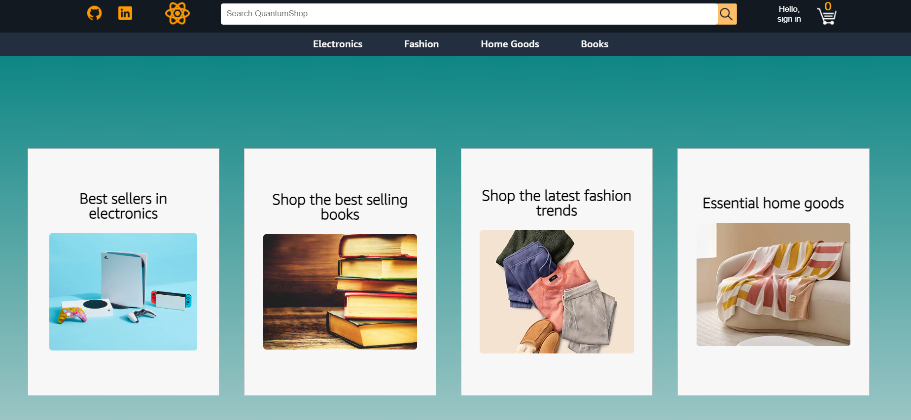
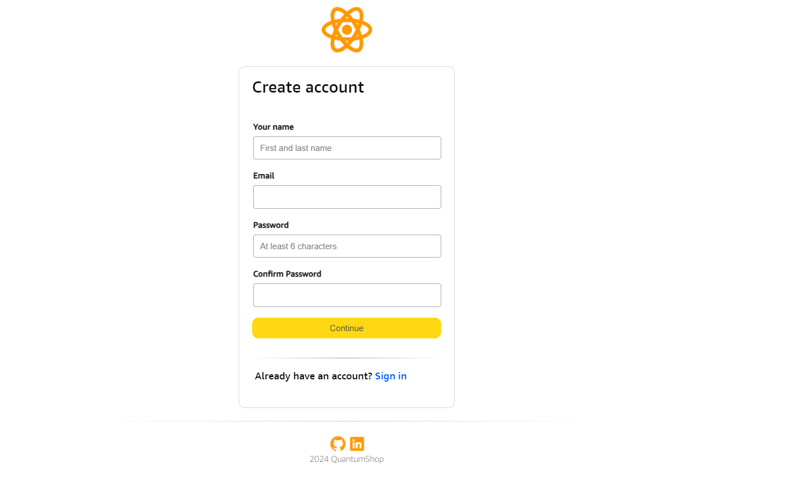
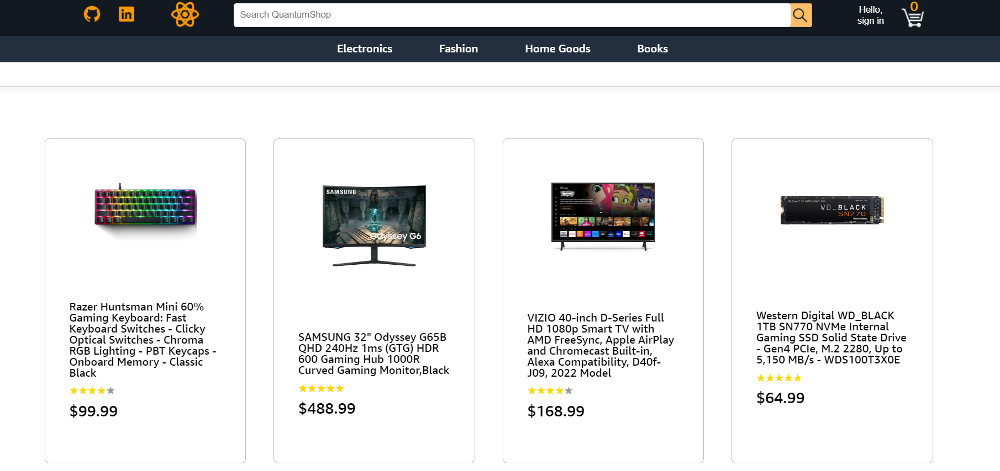
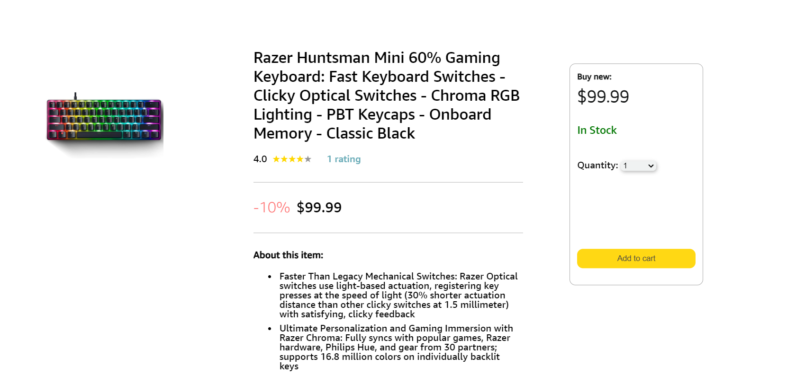

# QuantumShop

[QuantumShop Live!](https://quantumshop.onrender.com)


## Overview

QuantumShop stands as an innovative Amazon clone, offering users a familiar e-commerce experience. QuantumShop offers, User authentication (create account and sign up),  Shopping cart (add products to cart and edit your cart), Search through products (search through products and browse categories).

## Homepage



## Signup Form



## Products Index



## Product Show

___

## Technologies used

* Languages: JavaScript, Ruby, HTML, CSS
* Backend: Ruby on Rails
* Frontend: React-Redux
* Hosting: Render
* Databases: PostgreSQL
* Storage: AWS Simple Storage Service (S3)

___


## Features


### **Product Exploration**: Browse a vast array of products spanning various categories.


```javascript
  const ProductsIndex = () => {

  const dispatch = useDispatch();
  const products = useSelector(selectProductsArray);
  const { category } = useParams();


  useEffect(() => {
    dispatch(fetchProducts());
  }, [dispatch]);


  if (category !== 'electronics' && category !== 'books' &&  category !== 'home' && category !== 'fashion' && category !== 'all') {
    return <h1>hello</h1>;
  }


  
  return (
    <ul className='productsIndexPage'>
      <div className="productsIndexDivider"></div>
      <div className="productsContainer">
        {products.map((product, index) => (
          <NavLink key={`${product.id}_${index}`} to={`/products/${product.id}`}>
            <ProductItem  product={product}/>
          </NavLink>
        ))}
    
      </div>
    </ul>
  );
};

export default ProductsIndex;
```

___


### **Shopping Cart Functionality**: Easily add, remove, and manage items in your shopping cart.


```javascript
  const handleAddCartItem = async (e) => {
    e.preventDefault();
    if (sessionUser) {
      const user_id = sessionUser.id;
      const productToAdd = { quantity, product_id, user_id };

      const existingCartItem = cartItems.find(
        (item) => item.productId === productId
      );

      if (existingCartItem) {
        const updatedCartItem = {
          ...existingCartItem,
          quantity: existingCartItem.quantity + quantity,
        };
        dispatch(updateCartItem(updatedCartItem));

      } else {
        dispatch(createCartItem(productToAdd));
      }
    } else {
      navigate('/login');
    }
  };
```
___


### **User Authentication**: Create accounts, log in securely


```javascript
  const storeCSRFToken = response => {
    const csrfToken = response.headers.get("X-CSRF-Token");
    if (csrfToken) sessionStorage.setItem("X-CSRF-Token", csrfToken);
  };

  export const restoreSession = () => async dispatch => {
    const response = await csrfFetch("/api/session");
    storeCSRFToken(response);
    const data = await response.json();
    dispatch(setUser(data.user));


    dispatch(fetchCart());
    dispatch(fetchProducts());
    return response;
  };

  export const login = ({ credential, password }) => async dispatch => {
    const response = await csrfFetch("/api/session", {
      method: "POST",
      body: JSON.stringify({ credential, password }),
    });
    const data = await response.json();
    dispatch(setUser(data.user));
    dispatch(fetchProducts());
    dispatch(fetchCart());
    return response;
  };


  export const signup = (user) => async (dispatch) => {
    const { username, email, password } = user;
    const response = await csrfFetch("/api/users", {
      method: "POST",
      body: JSON.stringify({
        username,
        email,
        password,
      }),
    });
    const data = await response.json();
    dispatch(setUser(data.user));
    return response;
  };

  export const logout = () => async (dispatch) => {
    const response = await csrfFetch("/api/session", {
      method: "DELETE",
    });
    dispatch(removeUser());
    dispatch(fetchCart());
    return response;
  };

  const initialState = { user: null };

  const sessionReducer = (state = initialState, action) => {
    switch (action.type) {
    case SET_USER:
      return { ...state, user: action.payload };
    case REMOVE_USER:
      return { ...state, user: null };
    default:
      return state;
    }
  };

  export default sessionReducer;
```

___


### **Search Bar**: Search through all the products


```javascript
const SearchBar = () => {
  const [search, setSearch] = useState('');
  const dispatch = useDispatch();
  const navigate = useNavigate();

  const handleSearch = (e) => {
    e.preventDefault();
    const query = e.target.value;
    setSearch(query);
    dispatch(fetchSearch(query));
  };

  const handleSearchEnter = (e) => {
    if (e.key === 'Enter') {
      e.preventDefault();
      navigate(`/products/search?q=${search}`);
    }
  };

  const handleClick = (e) => {
    e.preventDefault();
    navigate(`/products/search?q=${search}`);
  };

  return (
    <div className='searchBarMain'>
      <input placeholder='  Search QuantumShop' className='searchBar' type="text" onChange={handleSearch} onKeyDown={handleSearchEnter} />
      
    </div>

  );
};

export default SearchBar;
```


## Future Implementation

- Reviews
- Search prediction dropdown
- User Profile


## Credits
- Images and products from  <a target="_blank" href="https://www.amazon.com/">Amazon</a> 
-  Icons/favicon by <a target="_blank" href="https://icons8.com">Icons8</a>

___